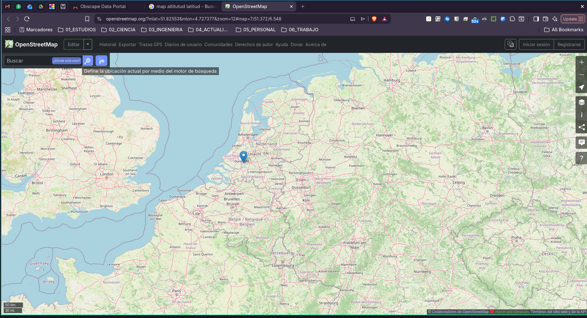

# cv-lit — Detección de línea de costa (Guardamar del Segura)

## Objetivo
Detección automática de playa seca a partir de imágenes oblicuas de cámaras fijas y transformación a línea de costa en formato geográfico (GeoJSON, EPSG:25830).

**Cliente:** Ayuntamiento de Guardamar del Segura  
**Colaboración:** Instituto de Ecología Litoral (IEL)  
**Duración:** 6 meses — 1 ingeniero a tiempo parcial, supervisado por Universidad de Alicante

---

## Fuente de datos — API Obscape

**Base URL:**
```
https://www.obscape.com/portal/api/v3/api?username=<username>&key=<APIkey>
```

**Credenciales:**
- Username: `fuster`
- Password portal: `Delfos17*`
- API Key: `c1RyHhP6aJBPRHwIUrpz9eEPHPGhlbuMZIujEUvWTJaJPXJO0x`

```
https://www.obscape.com/portal/api/v3/api?username=fuster&key=c1RyHhP6aJBPRHwIUrpz9eEPHPGhlbuMZIujEUvWTJaJPXJO0x
```

> **Nota:** password del portal y API key son cosas distintas. El API key se obtiene en el portal → usuario → User Settings.

**Portal:** https://obscape.com/portal

### Endpoints principales

| Propósito | URL |
|-----------|-----|
| Listar proyectos | `...&username=fuster&key=<API_KEY>` |
| Listar estaciones del proyecto | `...&project=<nombre>` |
| Datos de estación (últimas 24h) | `...&project=<p>&station=<id>` |
| Datos entre fechas | `...&station=<id>&from=yyyy-mm-ddThh:mm:ss&to=...` |
| Solo datos (sin metadatos) | `...&dataonly` |
| Imagen por timestamp | `...&station=<id>&image=<unix_ts>` |
| Última imagen | `...&station=<id>&image=latest` |
| Timezone local | `...&tz=local` |

### Formato de imagen descargada
`{unix_timestamp}_{YYYYMMDD}_{HHMMSS}_{station_id}.jpg`  
Ejemplo: `1777550400_20260430_120000_PTM61474.jpg`

### Estado de la API (verificado 2026-05-19)

La API responde correctamente y devuelve:
```json
[{"id":"5866","name":"Ketel Haven","devices":[],"latitude":"51.82553","longitude":"4.727377","reference":""}]
```



**Problema detectado:** el proyecto registrado bajo la cuenta `fuster` es **"Ketel Haven"**, ubicado en los **Países Bajos** (lat 51.82°N, lon 4.73°E — ver en mapa: https://www.openstreetmap.org/?mlat=51.82553&mlon=4.727377&zoom=12), y tiene `"devices": []` (sin cámaras registradas). Las 6 cámaras de Guardamar del Segura **no están vinculadas** a esta cuenta.

**Acción pendiente:** contactar con Obscape o el Ayuntamiento para confirmar bajo qué cuenta/proyecto están registradas las cámaras. Las imágenes locales (PTM61474) se proporcionaron como dataset de prueba manual (zip), no via API.

---

## Arquitectura del sistema (pipeline)

```
Imágenes cámaras
      │
      ▼
[3.1] Adquisición y preprocesado
      ├─ Normalización radiométrica
      ├─ Corrección de contraste/balance
      └─ Recorte ROI por cámara
      │
      ▼
[3.2] Segmentación semántica (SAM)
      ├─ Generación de regiones candidatas
      ├─ Mapa probabilístico arena seca / húmeda / agua
      └─ Umbral adaptativo + filtrado morfológico → máscara binaria
      │
      ▼
[3.3] Extracción de línea de costa
      ├─ Cálculo de contornos
      └─ Selección del borde húmedo-seco (polilínea en píxeles)
      │
      ▼
[3.4] Proyección homografía
      └─ (u,v) píxel → (X,Y) metros EPSG:25830
      │
      ▼
[3.5] Postprocesado + exportación
      ├─ Suavizado / simplificación métrica
      ├─ Filtros temporales (detección de anomalías)
      ├─ Cálculo de área seca (m²)
      └─ GeoJSON: ID_Camara, Timestamp, Confianza_IA, Area_Seca_m2
```

### Módulo offline (una sola vez por cámara)
**[3.0] Calibrado — estimación de homografía**
- Transectos GNSS del IEL (GCP en EPSG:25830)
- Correspondencias píxel ↔ UTM
- Corrección distorsión de lente (parámetros intrínsecos, OpenCV)
- RANSAC → matriz H por cámara
- Producto: **perfil de calibración** (H + params cámara + metadatos)

---

## Setup técnico

| Elemento | Versión / detalle |
|----------|-------------------|
| OS | Windows + Conda/Mamba |
| Python | 3.10 / 3.11 |
| Entorno | Miniforge / Mambaforge |
| IDE | VS Code |
| GIS | QGIS (validación EPSG:25830) |
| Deep Learning | PyTorch (SAM) |
| Visión | OpenCV |
| Geo | GDAL |

**Proyección de salida:** EPSG:25830 (ETRS89 / UTM zone 30N)  
**Fase horaria prioritaria:** imágenes a las **12:00h**

---

## Plan de trabajo

| Mes | Objetivo | Resultado |
|-----|----------|-----------|
| 1 | Preparación datos + diseño interfaces | Base de datos + especificación técnica |
| 2 | Calibración geométrica | Perfiles de calibración por cámara |
| 3 | Segmentación (prototipo) | Prototipo funcional SAM |
| 4 | Extracción línea + georreferenciación | Generación automática línea UTM |
| 5 | Validación y robustez | Sistema fiable con métricas |
| 6 | Integración y entrega | Sistema desplegado y operativo |

---

## Entregables finales

- Aplicación ejecutable configurada
- Perfiles de calibración por cámara (6 cámaras)
- Manual breve de uso
- Informe inicial de validación

---

## Métricas de validación

Comparación con transectos GNSS del IEL (puntos **no usados** en calibración):
- RMSE
- Error Medio Absoluto (MAE)

---

## Estado actual del proyecto

### Archivos
- `proces_images/` — scripts de preprocesado
  - `horizon_correct.py` — corrección interactiva de curvatura de horizonte
  - `images/` — imágenes de cámara PTM61474 (29/04/2026 – 06/05/2026), ~90 imágenes horarias
  - `camera_8214_from20260429_174800.zip` — dataset inicial (descarga manual)
- `obscape_api.py` — cliente Python para descarga automática de imágenes y metadatos via API

### Pendiente
- [ ] Confirmar cuenta/proyecto Obscape correcto para las 6 cámaras de Guardamar
- [ ] Obtener transectos GNSS del IEL (GCPs en EPSG:25830) para calibración
- [ ] Definir ROI por cámara
- [ ] Implementar módulo de calibración (homografía, OpenCV)
